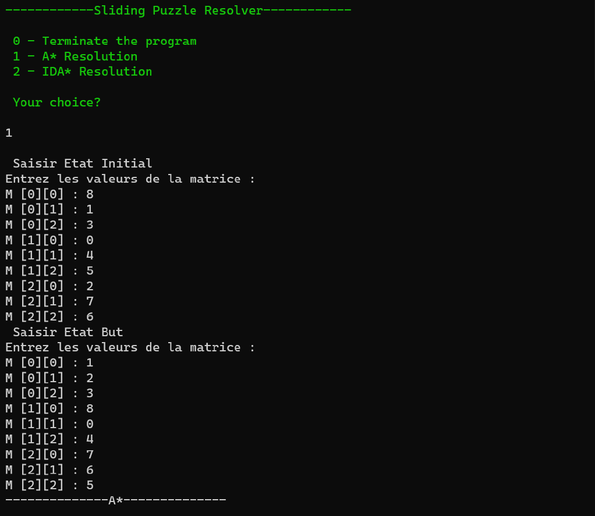

### README

---

Ce script implémente l'algorithme A* et l'algorithme IDA* pour résoudre un puzzle de taquin. Voici un aperçu des principales fonctionnalités et structures de données utilisées dans le script :

#### Structures de données :

- **Noeud** : Contient des informations sur l'état actuel du puzzle, telles que la configuration de la matrice, le parent du nœud, l'action qui a conduit à cet état et le coût.
  
- **Taquin** : Contient des informations générales sur le puzzle, telles que la racine du puzzle, la matrice de l'état final, des fonctions pour afficher le puzzle, générer des actions, tester si l'état actuel est l'état final et une fonction heuristique.

#### Fonctions principales :

- **creerRacine** : Crée la racine du puzzle à partir de l'état initial.
  
- **initTaquin** : Initialise la structure Taquin avec les données nécessaires.
  
- **CreerTaquin** : Crée une instance de Taquin.
  
- **Noeud_fils** : Crée un nœud fils à partir d'un parent en appliquant une action.
  
- **AEtoile** et **IDAEtoile** : Implémentent les algorithmes A* et IDA* respectivement pour trouver la solution du puzzle.

#### Fonctionnement :

- L'algorithme A* utilise une heuristique pour guider la recherche de la solution en estimant le coût pour atteindre l'état final à partir de l'état actuel.
  
- L'algorithme IDA* demande à l'utilisateur les états initial et final du taquin, puis recherche une solution en itérant avec une limite de recherche incrémentée jusqu'à trouver la solution ou atteindre la limite maximale.

---

Ce script est utile pour résoudre des puzzles de taquin en utilisant des techniques d'intelligence artificielle telles que l'algorithme A* et l'algorithme IDA*. Il fournit une implémentation claire et modulaire pour résoudre efficacement ces types de problèmes.
